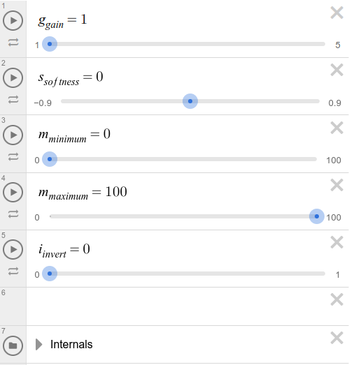
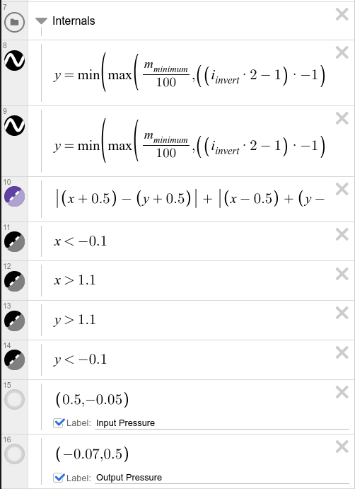

# Pressure Curve

## Desmos Graph Formulas

```
y=\min\left(\max\left(\frac{m_{minimum}}{100},\left(\left(i_{invert}\cdot2-1\right)\cdot-1\right)\left(\left(x\cdot g_{gain}\right)^{\left(1-s_{softness}\right)}\right)+i_{invert}\right),\frac{m_{maximum}}{100}\right)\left\{0\le s_{softness}\right\}\left\{0<x<1\right\}

y=\min\left(\max\left(\frac{m_{minimum}}{100},\left(\left(i_{invert}\cdot2-1\right)\cdot-1\right)\left(x\cdot g_{gain}\right)^{\left(\frac{1}{1+s_{softness}}\right)}+i_{invert}\right),\frac{m_{maximum}}{100}\right)\left\{0>s_{softness}\right\}\left\{0<x<1\right\}

\left|\left(x+0.5\right)-\left(y+0.5\right)\right|\ +\ \left|\left(x-0.5\right)+\left(y-0.5\right)\right|\ =\ 1
```



